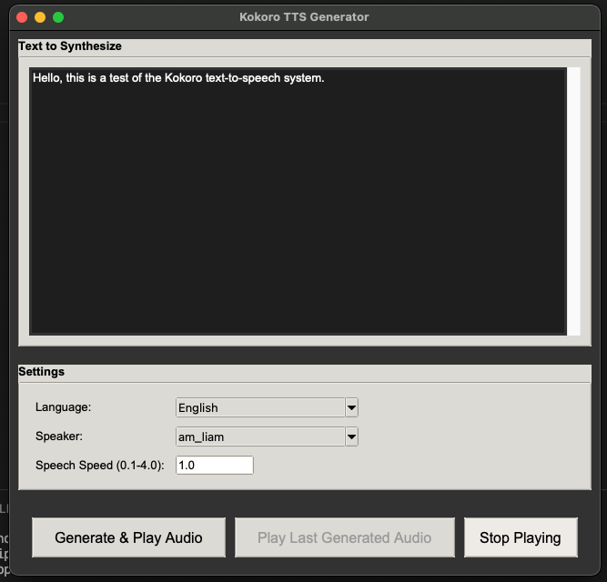

## Kokoro Text-to-Speech (TTS) Generator with GUI
This is based of Kokoro TTS and It uses kokoro_onnx model. 

1. Install Requirements
   
   `pip install -r requirements.txt`

2. Run the following command.
   
   `python TtsApp.py`

3. Gui Will appear and have fun

